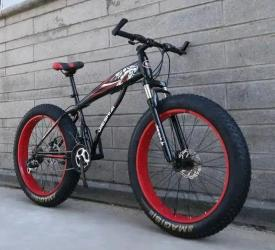
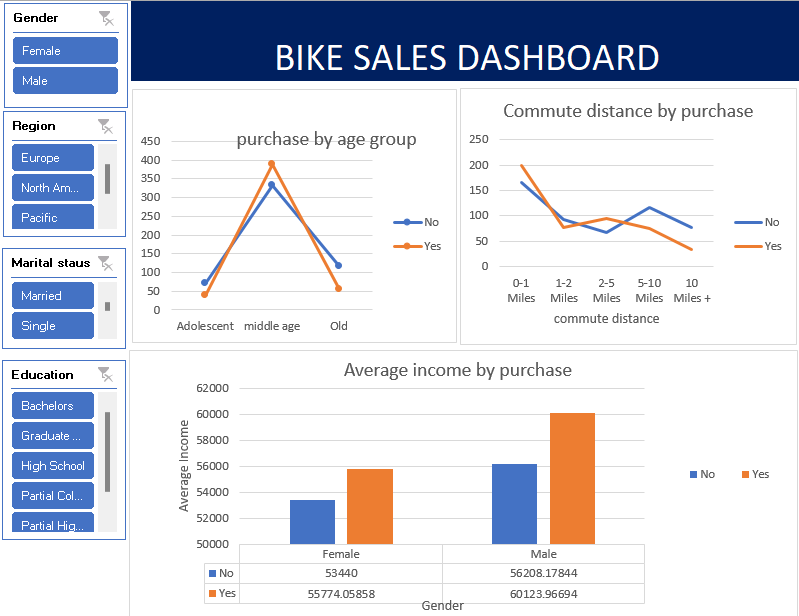

# Bike-sales-dashboard

## Introduction
This is a Ms Excel project on Bike sales in a community using imaginary data called bike sales. This 
project is to analyze and obtain insights to answer crucial question from the datasets and to make driven 
decisions. 

## Problem statement
The dataset which consists of 13 columns and over 1000 rows describes the age, income and level of education 
of bike buyers in a community. the following below are the problems that needs to be solved;

 - The total distance covered by the commutters
 - the average income of buyers
 - age with the highest purchase
## skills Demonstrated

The following Ms Excel skills were demonstrated; data cleaning, analysis and visualization.
With the data cleaning duplicates were removed from the rows, and some words were replaced with their full names
using the 'find and replace' function. 
The age column was converted to age group by creating another column called age group using the if function.
the formula "=if(cellnumber > specific age, old, if(cellnumber > specificage, middleage, if(cellnumber> specificage, adolescent, invalid)))".

## visualization
The visualization was done with Ms Excel as well displaying key insights for the solution for the problem statement above. the 
visualization consists of the dashboard title, the chart display and the slicers to control the chart as well. 

## Analysis 
Pivot table and pivot chart were used to breakdown the analysis for easy insights. A different sheet was created for the pivot table.

## conclusion

- Middle age group has the highest purchase of bike for the year
- For the gender, male has the highest income and they purchase the highest number of bikes as well
- Short distance where covered for the most bikes.
